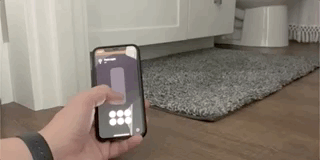

# SmoothLED
A Particle library for smooth color transitions that don't block the main thread. It even gracefully handles being interrupted in the middle of an animation for a buttery smooth UX.



## Usage
This library has only been tested with WS2812B LEDs so far, but it's using the [Particle-NeoPixel](https://github.com/technobly/Particle-NeoPixel) library under the hood, so it should work with many others.

```
#include "SmoothLED.h"

#define PIXELS_COUNT 21
#define LED_PIN D1
#define UPDATE_INTERVAL 10
#define TOTAL_STEPS 100

SmoothLED lights(
  PIXELS_COUNT,
  LED_PIN,
  // Optional, defaults to 5
  UPDATE_INTERVAL,
  // Optional, defaults to 50
  TOTAL_STEPS
);

void setup() {
  // Initialize control
  lights.begin();
  // Clear our the pixel buffer
  lights.clear();
  // Write to the pixels, this combined with the line above will make the pixels immediately turn off without a fade
  lights.show();
  // Fade to a medium brightness white
  lights.set(127, 127, 127);
}

void loop() {
  // This must be called in the loop for the light to updates
  lights.update();
}
```

See the [examples](examples) folder for more details.

## LICENSE
Licensed under the MIT license
